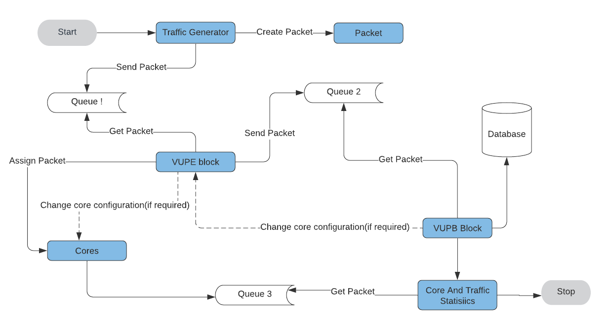

# Energy Efficiency in Data Centers using Machine Learning

## Abstract

With the rapid advancement of technology, the Information and Communication Technology (ICT) sector has seen a significant increase in energy consumption, surpassing 12% of global energy consumption in 2017. Data centers are a major contributor to this consumption, accounting for about 15% of the sector's energy use. This project addresses the high energy costs associated with servers and storage devices by proposing a method to reduce energy consumption through dynamic frequency scaling and machine learning. Using neural networks for traffic prediction, the method achieves up to 26% energy savings with an average packet loss of 0.73%.

## Table of Contents

1. [Introduction](#introduction)
2. [Literature Review](#literature-review)
3. [Methodology and Framework](#methodology-and-framework)
4. [Work Done](#work-done)
5. [Results and Analysis](#results-and-analysis)
6. [Conclusion and Future Work](#conclusion-and-future-work)
7. [References](#references)

## Introduction

The growth in mobile devices and services such as gaming, video streaming, and cloud computing has led to a surge in network traffic and energy consumption in the ICT sector. According to a survey by Ericsson, mobile subscriptions will exceed 9 billion by 2023, and network traffic is expected to reach 110 Exabytes per month. This increase in traffic drives up energy consumption, making it crucial to find solutions for more efficient energy use without significantly impacting service quality.

## Literature Review

### Related Work

1. **Dynamic CPU Frequency Scaling using Machine Learning for NFV Applications (2018)**: Explores techniques for dynamically adjusting processor frequency and voltage to match workload demands and reduce power consumption, leveraging machine learning for better performance.
   
2. **Energy Efficiency in the Future Internet: A Survey (2011)**: Discusses approaches to enhance energy efficiency in networking and provides a survey of technologies and trends in green networking.

3. **The Effects of Various Frequency Scaling Algorithms on Embedded Linux CPU Power Consumption (2014)**: Analyzes the impact of different frequency scaling algorithms on CPU power consumption in Linux systems.

### Problem Statement

The project's goal is to reduce energy consumption in mobile and other devices using machine learning, with an acceptable trade-off in packet loss over time.

### Objectives

- Minimize energy consumption at the expense of some packet loss.
- Reduce energy usage by adjusting core frequency, with high-frequency cores handling GBR data and lower-frequency cores handling non-GBR data.
- Adapt core configurations based on predicted traffic.

## Methodology and Framework

### System Architecture

### Methodology

The system is divided into four core sections:

1. **VUPB Block**: Generates virtual traffic, assigns packets to cores, calculates energy consumption, and manages core configuration based on traffic predictions.
   
2. **VUPE Block**: Receives packets, calculates energy consumption, and updates core configuration.

3. **Cores**: Process packets, adjust core frequency based on configuration changes, and calculate energy consumption.

4. **Core and Traffic Statistics Block**: Calculates packet loss and throughput, and plots results.

## Work Done

### Dataset

- **Packets Data**: Information regarding packets.
- **Fixed Interval Data**: Classified data for machine learning input.

### Multithreading

- Created a multithreaded system for simultaneous operation of 22 threads.
- Managed shared memory and avoided redundancy.

### Machine Learning

- Developed and trained an LSTM model for traffic prediction.

### Database

- Stored and analyzed data over regular intervals.

### C++ and Python Integration

- Used C++ for simulation and Python for machine learning tasks.

## Results and Analysis

### Parameters

- **Number of Cores**: 16
- **Threads**: 22
- **Frequency Range**: 0-3 GHz
- **Languages**: C++, Python

### Key Findings

- **Throughput**: Variation observed with maximum throughput between 8-17 hours.
- **Energy Consumption**: Energy savings of 26.34% on average.
- **Packet Loss**: Ranges from 0.1% to 1.3%, averaging 0.73%.

## Conclusion and Future Work

The project successfully demonstrates energy savings at the expense of packet loss. Future work could focus on optimizing the trade-off between power consumption and packet loss, and simulating core frequency changes in real-world scenarios to better understand discrepancies between simulations and actual applications.

## References

1. **LIGIA MARIA MOREIRA ZORELLO**, Dynamic CPU frequency scaling using machine learning for NFV applications, 2019.
2. **BRODOWSKI, D.**, CPU frequency and voltage scaling code in the Linux(TM) kernel. Linux CPUFreq User Guide, 2017.
3. **ERICSSON**, Ericsson Mobility Report, Sweden, 2017.
4. **BOLLA, R.** et al., Energy efficiency in the future internet: A survey of existing approaches and trends in energy-aware fixed network infrastructures, 2011.
